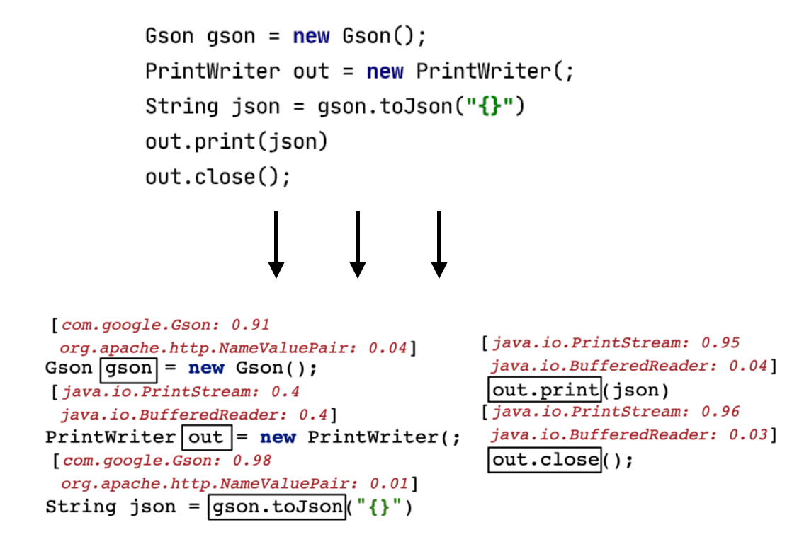

# RESICO
RESICO: an open source tool for resolving the simple names of API types in incomplete code snippets (e.g., from Stack Overflow) to their fully-qualified name.

This repository contains the experiments conducted on the paper.
The experiments are divided by three research questions corresponding to each one of the folders `rqX` in the repository.

We included the script responsible to make the different variants of the data contexts around an API element, namely: the variant with only classes, only methods or no neighbours at all.

The `data` folders contains part of the data considered in the analysis.
Within the folder `data/results` different datasets are stored with the variants in consideration.
Due to space constraints, we didn't include the data generated from the SOTorrent dataset.
If you want to get this data you can contact me.

Once the models are trained, RESICO should be able to predict the most like type in incomplete code snippets such as the following figure shows:

